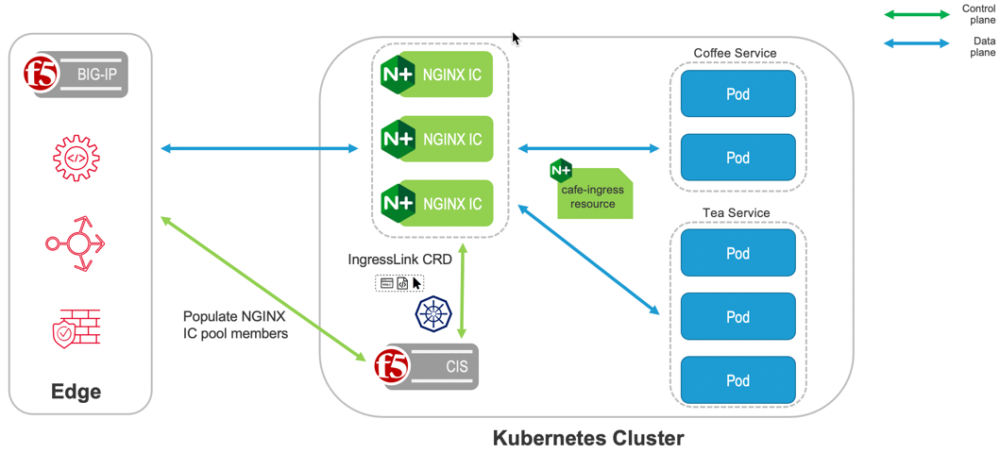

In this section, you create a F5 Ingress Link.  
- NGINX Ingress Controller.  
- BIG-IP Instance.  
- BIG-IP Container Ingress Services.  
- F5 Ingress Link.  

**Image source**: [F5 Clouddocs](https://clouddocs.f5.com/containers/latest/userguide/ingresslink/)  

   

# Pre-requisites:
- You must have performed all the steps in the parent directory [bigip-ctlr-ingress](https://github.com/laul7klau/kubernetes-aws/tree/main/bigip-ctrl-ingress) to create a BIG-IP instance and BIG-IP Container Ingress Service.  
- The BIG-IP CIS is working.

# Steps:   
## Remove any AS3 and BIG-IP CIS objects. 
Delete the AS3 and BIG-IP objects created previously in the parent [bigip-ctrl-ingress](https://github.com/laul7klau/kubernetes-aws/tree/main/bigip-ctrl-ingress)directory. Copy and paste the following:   
``kubectl delete -f as3.yaml``     
``sleep 2``   
``kubectl delete -f cis-deployment.yaml``   

To create F5 Ingress Link, create NGINX ingress controller followed by the BIG-IP Container Ingress Service.  
## Create NGINX ingress controller.   
1. Download and run the *create-nginx-ingress.sh* script.  
``wget https://raw.githubusercontent.com/laul7klau/kubernetes-aws/main/bigip-ctrl-ingress/ingressLink/create-nginx-ingress.sh``   
   ``chmod u+x create-nginx-ingress.sh``    
   ``./create-nginx-ingress.sh``   
   OR simply copy and paste the commands in the script all together.  
   
## Create F5 Ingress Link  
For F5 Ingress link, the BIG-IP CIS must run in Custom Resource Mode, CRD mode. 
1. Make a new copy of the cis-deployment file for F5 Ingresslink.  
``cp cis-deployment.yaml cis-ingresslink-deployment.yaml``  
``wget https://raw.githubusercontent.com/laul7klau/kubernetes-aws/main/bigip-ctrl-ingress/ingressLink/config/ingresslink.yaml``    

2. Edit  
   - *cis-ingresslink-deployment.yaml*:  
      - Uncomment "--custom-resource-mode=true",    
   - *ingresslink.yaml*:  
      - Replace 'virtualServerAddress: "??????"' with the VS IP. For single NIC, this is the self IP address.  

3. Create the following iRule on the BIG-IP instance:
   - Follow steps 4 and 5 in [Lab4.1 BIG-IP Setup](https://clouddocs.f5.com/training/community/containers/html/class1/module4/lab1.html) to create the iRule *Proxy_Protocol_iRule* on the BIG-IP instance.  
4. Copy and paste the following commands:  

   ``wget https://raw.githubusercontent.com/laul7klau/kubernetes-aws/main/bigip-ctrl-ingress/ingressLink/config/customresourcedefinitions.yaml``     

   ``wget https://raw.githubusercontent.com/laul7klau/kubernetes-aws/main/bigip-ctrl-ingress/ingressLink/config/ingresslink-customresourcedefinition.yaml``   

   ``kubectl apply -f cis-ingresslink-deployment.yaml``  
   ``kubectl apply -f ingresslink-customresourcedefinition.yaml``    
   ``kubectl apply -f customresourcedefinitions.yaml``     
   ``kubectl apply -f ingresslink.yaml``    
   
NGINX ingress controller, BIG-IP CIS, BIG-IP instance and F5 Ingress link are deployed!

# Verification:
- In the BIG-IP instance, 2 virtual servers (ports 80, 443) should be created with 2 pools (80, 443) in the **cispartition**.  
  - Each VS corresponds to the services declared in *'nodeport.yaml'* when creating the nginx-ingress controller. The selector in ingresslink.yaml must match the *'label'* in *'nodeport.yaml'*
  - The BIG-IP is in SSL passthrough mode where the VS does not have ssl profiles. SSL is terminated at the NGINX Ingress controller. 
- Access http://cafe.example.com/coffee and https://cafe.example.com/tea from a browser, where cafe.example.com is matched to the aws external IP of the BIG-IP instance in the OS host file. The coffee and tea app deployed with the NGINX ingress controller should display.

# Destroy:
1. Download and run the *delete-all.sh* OR copy and paste its commands.   
   ``wget https://raw.githubusercontent.com/laul7klau/kubernetes-aws/main/bigip-ctrl-ingress/ingressLink/delete-all.sh``    
2. On AWS portal, destroy the BIG-IP stack.  
   - Go to CloudFormation > Stacks > Name-of-Stack. 
   - Delete.  

